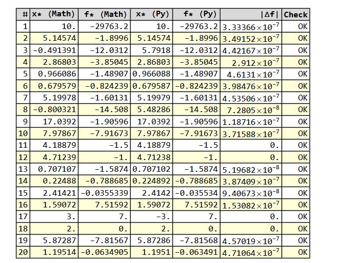

# Algoritmo Iterativo di Piyavski-Shubert

Implementazione in Python dell'algoritmo di ottimizzazione globale di Piyavski-Shubert per funzioni univariate Lipschitz-continue su intervallo chiuso $[a, b]$, con costante di Lipschitz $L$ nota.

---

## Struttura del progetto

```
├── testFunctions.py      # Funzioni di test (f1–f20) e TEST_REGISTRY
├── PiyavskiShubert.py    # Algoritmo principale
├── visualizer.py         # Visualizzazioni statiche e navigatore step-by-step
├── main.py               # Entry point (CLI + menu interattivo)
├── requirements.txt      # Dipendenze
└── README.md
```

---

## Installazione

```bash
pip install -r requirements.txt
```

**Dipendenze:** `matplotlib >= 3.8`, `numpy >= 1.26`

Per verificare le versioni installate:

```bash
pip show matplotlib numpy
```

---

## Modalità di esecuzione

### Avvio da terminale — esempi rapidi

```bash
# Esegui su una funzione di test (output testuale)
python main.py --fn 5

# Sovrascrivere i parametri di default
python main.py --fn 5 --a 0 --b 1.2 --L 36 --tol 1e-5 --max-iter 5000

# Grafico statico completo (3 pannelli)
python main.py --fn 5 --mode plot

# Navigatore passo-passo interattivo
python main.py --fn 5 --mode step

# Benchmark su tutte e 20 le funzioni
python main.py --allFunctions

# Lista delle funzioni disponibili con parametri default
python main.py --list
```

### Avvio da IDE (senza argomenti)

Lanciando `main.py` senza argomenti (ad esempio premendo *Run* in PyCharm o VS Code) si apre automaticamente il **menu interattivo**, che guida l'utente passo-passo nella scelta della funzione, dei parametri e della modalità di output.

```
==================================================================
   PIYAVSKI-SHUBERT — menu interattivo
==================================================================

  [1] Esegui su una funzione di test (f1-f20)
  [2] Benchmark su tutte e 20 le funzioni
  [3] Lista delle funzioni disponibili
  [0] Esci
```

### Argomenti CLI disponibili

| Argomento | Tipo | Default | Descrizione |
|---|---|---|---|
| `--fn N` | int | — | Indice funzione di test (1–20) |
| `--a FLOAT` | float | default funzione | Estremo sinistro dell'intervallo |
| `--b FLOAT` | float | default funzione | Estremo destro dell'intervallo |
| `--L FLOAT` | float | default funzione | Costante di Lipschitz |
| `--tol FLOAT` | float | `1e-4` | Tolleranza sul criterio d'arresto |
| `--max-iter INT` | int | `10000` | Numero massimo di iterazioni |
| `--mode` | str | `text` | Modalità output: `text` \| `plot` \| `step` |
| `--allFunctions` | flag | — | Esegue l'algoritmo su tutte e 20 le funzioni |
| `--list` | flag | — | Stampa la lista delle funzioni disponibili |

### Modalità di output

**`text`** — Stampa su terminale il punto ottimale $x^*$, il valore $f(x^*)$, il numero di iterazioni e valutazioni.

**`plot`** — Apre una finestra matplotlib con tre pannelli:
- in alto a sinistra: curva della funzione e punto ottimale trovato (★)
- in alto a destra: tende di Lipschitz all'ultima iterazione con tutti i punti valutati
- in basso: curva di convergenza $f^*(k)$ al variare delle iterazioni

**`step`** — Apre il navigatore passo-passo interattivo. Tre pulsanti (**◀ Prev** / **Next ▶** / **↺ Reset**) permettono di scorrere ogni singola iterazione dell'algoritmo, visualizzando in tempo reale:
- le tende di Lipschitz dello stato corrente della heap
- l'ultimo punto valutato (viola)
- l'ottimo corrente (stella rossa)
- la curva di convergenza aggiornata

---

## Descrizione dell'algoritmo

L'algoritmo di Piyavski-Shubert minimizza globalmente una funzione $f: [a,b] \to \mathbb{R}$ di cui si conosce la costante di Lipschitz $L$:

$$|f(x) - f(y)| \leq L \cdot |x - y| \quad \forall x, y \in [a, b]$$

Ad ogni iterazione:

1. **Selezione** — viene scelto l'intervallo con il **lower bound** più basso (estrazione dalla heap min in $O(\log n)$)
2. **Valutazione** — la funzione viene calcolata nel punto candidato $\hat{x}$, intersezione delle due rette di Lipschitz (*tenda*)
3. **Aggiornamento** — l'ottimo corrente viene aggiornato se $f(\hat{x})$ è inferiore al minimo noto
4. **Divisione** — l'intervallo viene spezzato in due sotto-intervalli che vengono reinseriti nella heap
5. **Criterio di arresto** — ci si ferma quando $f^* - lb_{\min} \leq \text{tol}$ oppure si raggiunge `max_iter`

Il lower bound di un intervallo $[x_i, x_{i+1}]$ è:

$$lb = R= \frac{f(x_i) + f(x_{i+1})}{2} - \frac{L \cdot (x_{i+1} - x_i)}{2}$$

Il punto di valutazione successivo $\hat{x}$ è:

$$\hat{x} = \frac{x_i + x_{i+1}}{2} - \frac{f(x_{i+1}) - f(x_i)}{2L}$$

---

## Struttura dati

Il cuore dell'implementazione è un **heap min** (`heapq`) di oggetti `Candidate`. Questa scelta garantisce:

- estrazione del candidato migliore in $O(\log n)$
- inserimento di nuovi candidati in $O(\log n)$

Ogni `Candidate` è un dataclass con i campi `lower_bound`, `x_hat`, `x_left`, `x_right`, `func_left`, `func_right`. L'ordinamento avviene automaticamente sul primo campo (`lower_bound`) grazie al decoratore `@dataclass(order=True)`.

Un'ottimizzazione (**pruning**) evita di inserire nella heap i sotto-intervalli il cui lower bound è già superiore all'ottimo corrente, riducendo significativamente il numero di candidati esplorati.

---

## Moduli

### `testFunctions.py`

Contiene le 20 funzioni di test e il registro `TEST_REGISTRY`:

```python
TEST_REGISTRY: dict[int, tuple] = {
    1: (f1, (a, b, L)),
    ...
    20: (f20, (a, b, L)),
}
```

### `PiyavskiShubert.py`

Funzione principale:

```python
from PiyavskiShubert import piShAlgorithm

result = piShAlgorithm(
    f        = func,
    a        = a,
    b        = b,
    L        = L,
    tol      = 1e-4,
    max_iter = 1000,
    store_candidates = False   # True per salvare snapshot heap (richiesto da plot/step)
)
```

Il risultato è un oggetto `PiyavskiShubertRes` con i campi:

| Campo | Descrizione |
|---|---|
| `x_opt` | Punto ottimale trovato |
| `f_opt` | Valore ottimale trovato |
| `iterations` | Numero di iterazioni eseguite |
| `n_evals` | Numero totale di valutazioni di $f$ |
| `history` | Lista di `(iter, x_opt, f_opt)` per ogni step |
| `candidates_log` | Snapshot della heap ad ogni iterazione (se `store_candidates=True`) |

### `visualizer.py`

Contiene il dataclass `TestFunction` e due funzioni pubbliche:

```python
from visualizer import plot_result, step_visualizer, TestFunction

tf = TestFunction(name="f5", func=f5, a=0, b=1.2, L=36)

# Grafico statico
fig = plot_result(tf, result)
plt.show()

# Navigatore interattivo
step_visualizer(tf, result)
```

### `main.py`

Entry point che gestisce sia la CLI (`argparse`) sia il menu interattivo. Non contiene logica algoritmica.

---

## Funzioni di test

| # | Intervallo | L |
|---|---|---|
| f1 | [-1.5, 11] | 13870 |
| f2 | [2.7, 7.5] | 4.29 |
| f3 | [-10, 10] | 67 |
| f4 | [1.9, 3.9] | 3 |
| f5 | [0, 1.2] | 36 |
| f6 | [-10, 10] | 2.5 |
| f7 | [2.7, 7.5] | 6 |
| f8 | [-10, 10] | 67 |
| f9 | [3.1, 20.4] | 1.7 |
| f10 | [0, 10] | 11 |
| f11 | [-1.57, 6.28] | 3 |
| f12 | [0, 6.28] | 2.2 |
| f13 | [0.001, 0.99] | 8.5 |
| f14 | [0, 4] | 6.5 |
| f15 | [-5, 5] | 6.5 |
| f16 | [-3, 3] | 85 |
| f17 | [-4, 4] | 2520 |
| f18 | [0, 6] | 4 |
| f19 | [0, 6.5] | 4 |
| f20 | [-10, 10] | 1.3 |

---

## Confronto con Wolfram Mathematica

La sezione seguente riporta un confronto dei risultati ottenuti dall'algoritmo di Piyavski-Shubert con i minimi globali calcolati analiticamente tramite **Wolfram Mathematica** (funzione `NMinimize`), a scopo di validazione.


---

## Note

- Un valore di $L$ **troppo piccolo** può portare a escludere regioni con minimi globali.
- Un valore di $L$ **troppo grande** rallenta la convergenza aumentando il numero di iterazioni.
- Il flag `store_candidates=True` ha un costo in memoria proporzionale al numero di iterazioni; usarlo solo quando necessario per la visualizzazione.